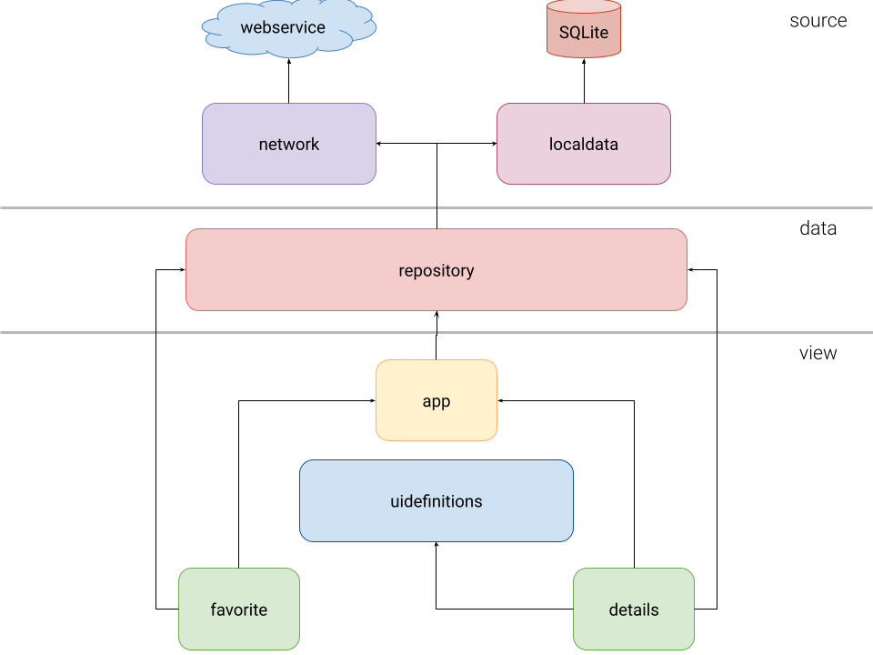

# Gifs App   
This is a sample app that access [Giphy API](https://developers.giphy.com/) to show the trending GIFs in Giphy Platform.  

## Architecture

> Before explaining this project architecture, I would like to emphasize that it's a project wich its main purpose is **studying Android development**, it has a lot of modules for a simple flow of screens. So, its architecture **certainly** could be simplified for a real case project.

This project was written in an architecture divided by layers, this concept can be found in an explanation at [Recommended app architecture](https://developer.android.com/jetpack/guide#recommended-app-arch) web page. Here follows a quick explanation about each layer and its module(s):

 - **Source:** This layer communicates with different kinds of data sources. In this project we have two modules, each one responsible for getting or putting data in one kind of data source, the modules are:
    - **network:** It retrieves data from the network datasource and it has [Retrofit](https://square.github.io/retrofit/) with [Kotlin Coroutines](https://kotlinlang.org/docs/coroutines-overview.html) to get data from webservice.
    - **localdata:** It stores data of Gifs marked as **favorite** by users in a local database, so if the user leaves the application this data isn't lost. The library [Room](https://developer.android.com/training/data-storage/room) is used to do this operation.
 - **Data:** This layer has only one module, and is the layer between **View** and **Source**. Its module is called repository:
    - **repository:** This module is responsible for getting data from the **network** and translating its data to a format friendly for **UI** modules, as [Giphy Trending API](https://developers.giphy.com/docs/api/endpoint#trending) returns paged data, the library [Paging 3](https://developer.android.com/topic/libraries/architecture/paging/v3-overview) is used to be able to get Gifs in paged web responses with an API friendly for the usage of [Kotlin Coroutines](https://kotlinlang.org/docs/coroutines-overview.html).
- **View:** This layer has the modules to communicate and interact with the app user. It has four modules, three that have feature implementation and one utility module. Each feature module uses the [MVVM pattern](https://developer.android.com/jetpack/guide#build-ui), where views ([Activity](https://developer.android.com/guide/components/activities/intro-activities) or [Fragment](https://developer.android.com/guide/fragments)) interact and responds to user actions and communicate to a [ViewModel](https://developer.android.com/topic/libraries/architecture/viewmodel), which is responsible for calling repository to retrieve and/or store data. The modules in this layer are:
    - **app:** It has the code for the first screen in the app that shows the trending Gifs in a list. It has the configuration for the navigation in the app, it uses the [Jetpack Navigation](https://developer.android.com/guide/navigation) library to do that. Besides this, all other features in this project are [Dynamic Features](https://developer.android.com/guide/playcore/feature-delivery#customize_delivery), so the other feature modules depend on this app module in this project architecture. You can find more about the implementation of the dynamic modules in the [section below](#android-dynamic-modules).
    - **favorite:** This module has the implementation of a favorite gifs list, where the user can find its gifs marked by favorite.
    - **details:** This module shows the details of a gif, which currently are just its image and title. This module was written with the main purpose of studying the usage of [Jetpack Compose](https://developer.android.com/jetpack/compose) in an existing app, so its UI is written with this library.
    - **uidefinitions:** This module was written just after the **details** module. It has initially some UI definitions needed by [composable functions](https://developer.android.com/jetpack/compose/layout) that could be used by other modules that could be developed using the same kind of library. 
 
Besides all of that, this project has the library [koin](https://github.com/InsertKoinIO/koin) to configure its dependencies and inject where they are needed, also it has the [mockk](https://mockk.io/) library to mock some responses and isolate some tests, and [detekt](https://detekt.github.io/detekt/) gradle plugin is used to have a code check after each commit.
 
 ## More details about its architecture:
  
### Android Dynamic Modules  
This project uses the [Android Dynamic Module](https://developer.android.com/guide/app-bundle/dynamic-delivery) where some features aren't installed for the first time to the users, instead of that, they are installed once the features are accessed.  
The usage sample is in the access to Favorite Gifs screen, on module **favorite**,  and the access to Details screen, om module **details**.
To check the implementation info, read my post on [Medium](https://medium.com/@angelica.liv/utilizando-m%C3%B3dulos-din%C3%A2micos-no-seu-app-android-e04875765586)! ;)  
  
### Jetpack Navigation with Feature Modules
To navigate between screens and to make Dynamic Feature Module implementation easier, there is the implementation of the [Dynamic Navigator](https://developer.android.com/guide/navigation/navigation-dynamic) library. [Here](https://medium.com/android-dev-br/implementando-jetpack-navigation-component-com-m%C3%B3dulos-de-features-din%C3%A2micas-no-android-e604c13d235f) you can find a post about this library integration on an existing app.  
  
## How can I build?  
To build the project in your own machine, please update the **keys.gradle** file with your **own** keys in Giphy platform access (click [here](https://developers.giphy.com/dashboard/?create=true) to create an app).  
  
  
  
> Written with [StackEdit](https://stackedit.io/).
